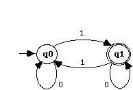

Introduction
============

([To Jacaranda README.md](../../README.md))

Aim of this Java framework realization is to provide an easy and customizable design for the implementation of different finite-state machines (FSM).
The added value in respect to other implementations is the framework character of the system, which offers different flexible and customizable parts (hot spots) through which the user not only can change, as usual, the content of the finite-state machine updating the input document with different states and arcs relations, but also customize it in different ways, including type of arcs, kind of output, way of traversing, etc., creating its own instance of the desired FSM.
I begin this introduction briefly explaining some concepts on finite-state machines and, above all, introducing some terms, used all over the documentation.

## 1. Finite-State Automata

A deterministic finite automaton is a mathematical model of a machine that accepts a particular set of words over some alphabet E.
An informal abstraction of the concept can be shown visualizing the automaton through a black box representing the finite-state control which reads an input tape. When the read head reaches the end of the input word, the black box informs whether the word has been accepted. This mechanism is also called finite-state acceptor.

Although finite automata are usually thought of as processing strings of letters over some alphabet, the input can conceptually be elements from any finite set.
In the Jacaranda object-oriented framework implementation the finite set can be built with any kind of object.

### Definition

A deterministic finite-state automaton (DFA) is a quintuple <E,S,s0,d,F> where:

- E is the input alphabet (a final non empty set of symbols).
- S is a finite non empty set of states.
- s0 is the initial state, element of S.
- d is the state transition function. d: S x E -> S.
- F is the set of final states, a subset of S.

The input alphabet, E, for any deterministic finite automaton A, is the set of symbols that can appear on the input tape. Each successive symbol in a word will cause a transition from the present state to another state. The transition is described by the state transition function. For deterministic finite-state automata there is exactly one state transition for each combination of a symbol a and a state s.
To produce a formal description of a DFA it is necessary to enumerate each part of the quintuple that comprises it. The state transition diagram is used to display the transitions of the d function and at the same time to illustrate the other four parts of the quintuple.

### Example

Let describe a simple DFA with an alphabet of two symbols (1 and 0), which accepts all kinds of words where the symbols 1 appears an odd number of times.
A = <E,S,s0,d,F>

where
- E = {0,1}
- S = {q0,q1}
- s0 = q0
- F = {q1}

and d is represented by the following transition table:

And here is the state transition diagram:

### Non-Deterministic Finite-State Automata

A non deterministic finite automaton (NDFA) is a generalization of the deterministic machines. Important for the recognition ability is that the class of languages recognized by NDFA is exactly the same as the class of languages recognized by DFA, i.e. their recognition powers are equivalent.
The Jacaranda framework allows the full customization of the traversal algorithm responsible for the recognition of input words. As "out of the box" implemented variants the frameworks offers the deterministic traversal, as well as the non deterministic one.

## 2. Finite-State Transducers

The finite-state automata are useful when the task is to reliably recognize a sequence, delivery "yes" or "no" as only result. They do not produce output.
Finite-state machines able to accepts input sequences and translate them into output sequences are called sequential machines or transducers. Those machines have transitions from one state to the other which generate an output symbol while accepting an input one.
The black box representation used for DFA can also be proposed for transducers, adding an output tape.

Application of these machines can be elevators, traffic lights and other devices that monitor and react to limited stimuli.
One important application is in the field of computational linguistics: word form analysis and word form generation has proved to be best realized, for performance and memory need, with finite-state transducers.

### Definition

A finite-state transducer (FST) is a sextuple <E,I,S,s0,d,w> where:

- E is the input alphabet.
- I is the output alphabet.
- S is the set of states, a finite non empty set.
- s0 is the initial state.
- d is the state transition function. d: S x E -> S.
- w is the output function. w: S x E -> I.

The formal definition does not specify the set of final states, as the DFA definition does. This is because conceptually the transducer builds its output chronologically. In many concrete applications, however, the transducer is used to accumulate a result, that must be confirmed when the entire input word has been processed. In such cases we need to specify the set of final states.
Within the Jacaranda framework a transducer is simply seen as an extension of an automaton. The definition of final states is then included and straightforward.

### Example 1

The first example represents a FST which flags occurrences of the pattern AAB by printing a 1 on the output tape, only when the substring AAB appears in the input stream.
Notice the use of "/" (slash) to separate input element from output element within a single arc.

### Example 2

The second example represents the application of a FST for word forms analysis and generation.

Notice the use of final states, as confirmation of the output generated during the traversal.
In this representation not only single characters, but also full symbols are shown as part of the alphabet.
Because the Jacaranda framework uses objects for the single arcs, this causes no problem for the application developer. I have however described in the second cookbook receipt how the framework offers the opportunity to code further information at the end of each recognized sequence. This seems an even better solution for this particular case, because the symbols "+Base", "+Past", etc. are not really part of the sequence to analyze or generate, rather they are information to deliver at the end of the recognized sequence, together with its generated output.
Another important remark offered by this particular application is the bi-directional use of the transducer. You can traverse it accepting input elements and generating output ones, but you can also traverse it accepting output elements while generating input ones as result. This is why with the same transducer you can analyze the word form "dined", saying that it is a past form of "dine", as well as generating "dines" and "dined" as output of the citation form "dine". Both directions can deliver more than one result. The traversing must therefore consider the non deterministic character of the FSM.
This functionality is fully supported by the Jacaranda framework, which allows the sharing of data for different purposes. 
In the framework terminology I call analysis the input/output direction, and generation the output/input one.

## 3. Documents

The documents used as input of the framework, while allowing customizable kinds of arcs and information for final states, have a formal syntax.
Here is its description, using EBNF notation. I will mention it again in the first recipe of the cookbook.

    document     = {state | place-holder}+.
    place-holder = index.
    state        = (empty-flag {arc}+) | (info-flag {arc}).
    empty-flag   = "}".
    info-flag    = "{" {index}+ "}".
    arc          = input-element output-element.
    index        = [-] {digit}+.
    input-element -> customized element.
    output-element -> customized element.

The following text is an example using characters as input and output elements:

    }ccmm
    }aa
    }tt
    }hh
    }oo
    }dd
    {1}s#
    {2}
    }ee
    2

The last element is a place holder for an existing cluster. This allows a recursive mechanism and a fairly high compression rate, which corresponds to transforming a trie structure into a FSM.
A conversion tool (shaken Jacaranda) is needed to produce documents starting from a list of words, converted first into a trie and then into a minimized finite-state structure to be accepted as input by the framework. The tool is not part of this release (different test documents with hundreds of states are delivered with the framework). However, if the structure of the FSM is known, the document can be produced very easily.
Let me show how to proceed starting from the following known DFA (only transforming the previous used alphabet {0,1} into {a,b}, to be able to read the document more easily at the end of the process, avoiding confusion with the numbers referring to the states):

There are three steps to perform:

- Stretch graphically the FSM (in this case a simple DFA) into a tree, using the initial state as root and creating a new child for each arc. Recursively repeat the transformation in a leftmost recursive way for each new generated child until each state of the FSM is represented once with all its children.

Reading the resulting tree in a leftmost recursive way, transform each repeated state into a place holder (shown as small square in the following representation). The resulting tree should appear with all leaves represented as square.

- Copy the elements into a text file always following the leftmost recursive descent, considering the following:
  - If no particular output information needs to be coded into a final state, the latter can be represented with whatever index.
  - Each state will use a text line in the file to represent its state information and its list of outgoing arcs. Each line representing a full state has an implicit incremental index, starting by 0. This index is used by the place holders to refer to their original state.
  - A place holder is simply an index, referring to its original state.

Here is the final document for the considered FSM:

    }ab
    0
    {1}ab
    1
    0

The formalism is quite simple and could be easily generated by the formal description of the FSM. But this is not the peculiarity of the system, which is intended to be used, in a customized way, for large FSMs, with many thousands of arcs and states, as it is partly shown in the second receipt of the delivered cookbook.
