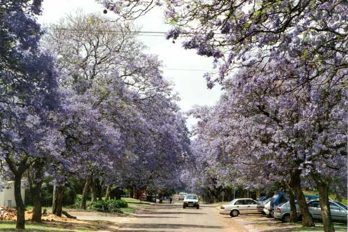

The Jacaranda Picture Show
============

([To Jacaranda README.md](../../README.md))

This section shows some pictures of the Jacaranda city and describes the "shaken trie" algorithm (shaken Jacaranda) in a very (very) informal way. The algorithm is used to generate the FSM structure from the corresponding list of accepted words.
Some explanations on the document syntax can be found in the introduction.

A trie is a particular n-tree structure where information is stored not only in the nodes, but also in the paths to the nodes. It is used in information retrieval (the term "trie" derives from the word "retrieval") to organize text information and to accelerate access into databases.

The algorithm that I use to prepare the input data for the framework FSMs starts from the bottom of a trie structure, removing every redundant node,  reducing the trie structure into a finite-state machine structure. I developed the algorithm some years ago and I called it "shaken trie", because of its characteristic of making the leaves of the trie falling down during the process of shaking. The similarity goes well with a shaken Jacaranda losing blooms in October.

## 1. General Overview

This is the overview of the Jacaranda city from the University of Pretoria.
The lilac-purple elements are some of the estimated 80,000 Jacaranda trees in the city.

## 2. Jacaranda Collection

An unsorted collection of Jacarandas before applying the reducing algorithm.

## 3. Jacaranda Clusters

The trees' elements are organized in clusters. Every state contains the cluster of outgoing arcs. Redundant states are eliminated by the algorithm.

## 4. Shaken Jacaranda

The "shaken Jacaranda" algorithm takes long (O(k*n2)) to eliminate the redundant  states and needs extra help data structures during run time. The picture shows the result after a night of process running. All eliminated states will be garbage collected.

## 5. Warnings

Just to warn not to park under a Jacaranda during the shaken algorithm's run.

## 6. Garbage Collection

The eliminated states with their outgoing arcs' clusters are garbage collected after the shaken algorithm's run.

